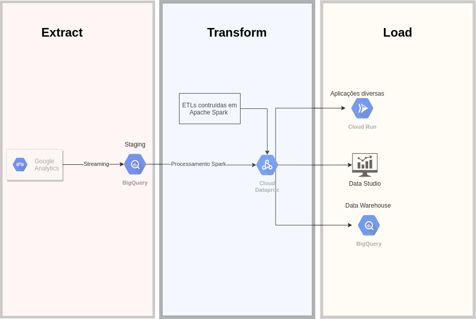
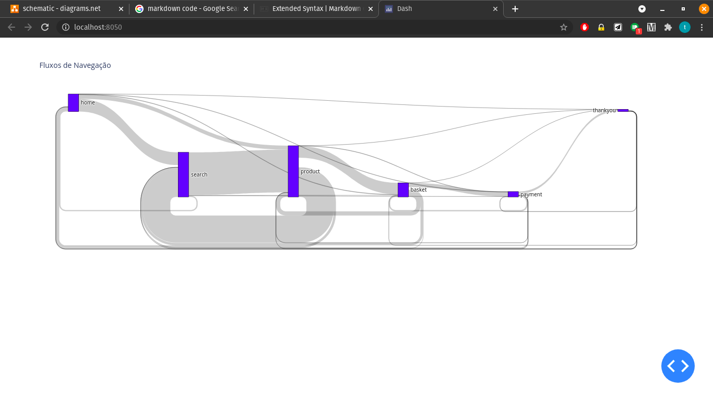

# Proposta de Pipeline de ingestão de dados navegacionais
O documento será dividido em duas seções principais:
- A proposta de solução de produção;
- MVP da etapa de ETL reproduzível da solução proposta.


## Solução de produção
Propõe-se a implementação de um Pipeline no GCP, devido a integração com o Google Analytics, possível fonte de dados navegacionais e também em função da atual utilização de GCP na B2W.



O modelo conceitual parte da premissa de que os dados de navegação estão sendo gerados no Google Analytics (GA). A partir dai, alimenta-se uma tabela BigQuery usando as ferramentas de exportação em streaming que o próprio GA disponibiliza.

Essa tabela BigQuery atuará como uma tabela de Staging, sendo um landing que será acessado pelo Dataproc. A camada Dataproc será responsável pelas transformações, usando o ecossistema Hadoop, Spark e Kafka para isso. O MVP de uma ETL desse projeto está em anexo, escrita em PySpark.

A camada final consistirá de paineis do DataStudio, ferramenta de visualização dentro do ecossistema GCP. Além disso, os dados proveninentes da camada de Transformação serão escritos na Data Warehouse final, também no BigQuery, que poderá alimentar outras análises, porém com latência. Inclusive, para evitar essa latência que se recomenda a conexão direta do pipeline do Dataproc no DataStudio.

## MVP da etapa de Transformação
Para reproduzir o MVP, temos duas opções:
### Manualmente: 
1. Instalar Spark;
2. Instalar dependencias python com  ```pip install -r requirements.txt```
3. Rodar script principal com ```python analise.py```
4. Acessar localhost:8050;

### Docker (Recomendado)
1. Fazer o build da imagem com ```docker build --pull --rm -f "Dockerfile" -t testefx2021:latest "." ```
2. Rodar o container com ```docker run -i -p 8050:8050 -d  testefx2021:latest```
3. Acessar localhost:8050.


